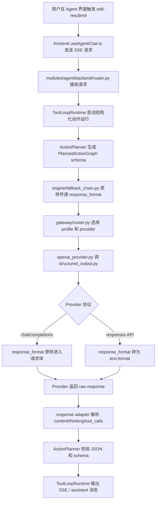

# Agent Structured Output 完美适配执行计划

## 流程图

## 改什么

1. 新增 `backend/app/gateway/structured_output.py`。
2. 删除 `backend/app/gateway/router.py` 里的 `_response_format_for_profile()`。
3. `backend/app/gateway/router.py` 的 `chat()` 原样传递 `response_format`。
4. `backend/app/gateway/router.py` 的 `chat_stream()` 原样传递 `response_format`。
5. `backend/app/gateway/openai_provider.py` 调用 `structured_output.py` 生成 provider 请求体。
6. 删除重复测试 `backend/tests/test_gateway_structured_output.py`。
7. 合并测试到 `backend/tests/test_gateway_response_format.py`。

## 怎么改

1. `structured_output.py` 提供两个函数：
   - `response_format_for_chat_completions()`：chat/completions 协议原样传递统一格式。
   - `response_format_for_responses_api()`：responses API 把统一 `json_schema` 转成 `text.format`。
2. `router.py` 不读取 `structured_output_mode`，不改写 `response_format`。
3. `openai_provider.py` 是唯一出站结构化输出适配入口。
4. `ActionPlanner` 继续生成 schema 和校验返回结果，不处理 provider 差异。
5. 测试拆成小块：
   - provider payload 测试
   - router passthrough 测试
   - structured output 小模块测试
   - profile capability marker 测试

## 实际使用流程

1. 用户编辑 Agent 消息并重发。
2. 前端发送 `edit-resubmit` SSE 请求。
3. Agent planner 生成结构化计划 schema。
4. Gateway router 选择模型 profile。
5. Gateway router 原样传递 `response_format`。
6. Provider 根据协议构造请求体。
7. 模型返回结构化文本。
8. Agent planner 用 Pydantic schema 校验。
9. 校验通过后执行动作或直接回答。
10. 校验失败时返回明确的 structured output 错误，后续按单点快速维修。

## 验收结果

1. `backend/tests/test_gateway_response_format.py` 通过。
2. `backend/app/gateway/router.py` 不再包含 `_response_format_for_profile()`。
3. `backend/tests/test_gateway_structured_output.py` 已删除。
4. `response_format=json_schema` 在 router 中保持原样。
5. `responses` API 的格式转换只发生在 `structured_output.py`。
6. `chat/completions` 的格式传递只发生在 `structured_output.py`。
7. `ActionPlanner` 不含 provider 特判。

## 主干文件

- `backend/app/gateway/structured_output.py`
- `backend/app/gateway/openai_provider.py`
- `backend/app/gateway/router.py`
- `backend/tests/test_gateway_response_format.py`
- `modules/agent/backend/runtime/action_planner.py`

## 已删除重复轮子

- `backend/app/gateway/router.py::_response_format_for_profile`
- `backend/tests/test_gateway_structured_output.py`

## 后续快速维修落点

1. Provider 报 400：查 `backend/app/gateway/structured_output.py` 和 `backend/app/gateway/openai_provider.py`。
2. Router 没传参：查 `backend/app/gateway/router.py`。
3. 模型返回不合 schema：查 `modules/agent/backend/runtime/action_planner.py`。
4. 前端显示错误：查 `modules/agent/frontend/composables/useAgentChat.ts`。
5. 测试失效：查 `backend/tests/test_gateway_response_format.py`。
